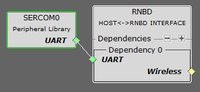

# RNBD451 BLE HEART RATE SENSOR

> "IoT Made Easy!" 

Devices: **| RNBD451 |** 
Features: **| BLE | HEART RATE |**

## ⚠ Disclaimer

<b>
THE SOFTWARE ARE PROVIDED "AS IS" AND GIVE A PATH FOR SELF-SUPPORT AND SELF-MAINTENANCE. This repository contains example code intended to help accelerate client product development.  

For additional Microchip repos, see: <a href="https://github.com/Microchip-MPLAB-Harmony" target="_blank">https://github.com/Microchip-MPLAB-Harmony</a>

Checkout the <a href="https://microchipsupport.force.com/s/" target="_blank">Technical support portal</a> to access our knowledge base, community forums or submit support ticket requests.

</b>

## Contents

1. [Introduction](#step1)
1. [Bill of materials](#step2)
1. [Hardware Setup](#step3)
1. [Software Setup](#step4)
1. [Harmony MCC Configuration](#step5)
1. [Board Programming](#step6)
1. [Run the demo](#step7)

## 1. Introduction<a name="step1">

This application demonstrates how to add the [RNBD451 Add-on Board](https://www.microchip.com/en-us/development-tool/ev25f14a) to an existing application via UART and to implement a BLE heart rate sensor using [HEART RATE 9 CLICK](https://www.mikroe.com/heart-rate-9-click). Here we have taken an existing [Heart Rate application with SAME51](https://github.com/Microchip-MPLAB-Harmony/reference_apps/tree/master/apps/sam_e51_cnano/same51n_mikroe_click/heartrate9) and added the [RNBD451 Add-on Board](https://www.microchip.com/en-us/development-tool/ev25f14a) to make it wireless. The RN commands are sent from the [SAM E51 CURIOSITY NANO BOARD](https://www.microchip.com/en-us/development-tool/ev76s68a) to establish the heart rate BLE sensor application, which can be viewed in the [MBD](https://play.google.com/store/apps/details?id=com.microchip.bluetooth.data&hl=en_IN&gl=US) application.

## 2. Bill of materials<a name="step2">

| TOOLS | QUANTITY |
| :- | :- |
| [SAM E51 CURIOSITY NANO BOARD](https://www.microchip.com/en-us/development-tool/ev76s68a) | 1 |
| [CURIOSITY NANO BASE FOR CLICK BOARDS](https://www.microchip.com/en-us/development-tool/ac164162) | 1 |
| [RNBD451 Add-on Board](https://www.microchip.com/en-us/development-tool/ev25f14a) | 1 |
| [HEART RATE 9 CLICK](https://www.mikroe.com/heart-rate-9-click) | 1 |

## 3. Hardware Setup<a name="step3">

- Connect the HEART RATE 9 Click Board to the Mikro Bus 1 and RNBD451 Add-on Board to the Mikro Bus 2 and connect the SAM E51 CURIOSITY BOARD as shown below.

## 4. Software Setup<a name="step4">

- [MPLAB X IDE ](https://www.microchip.com/en-us/tools-resources/develop/mplab-x-ide#tabs)

    - Version: 6.10
	- XC32 Compiler v4.30
	- MPLAB® Code Configurator v5.3.7
	- SAME51_DFP v3.7.242
	- MCC Harmony
	  - csp version: v3.18.0
	  - dev_packs: v3.17.0
	  
- Any Serial Terminal application like [TERA TERM](https://download.cnet.com/Tera-Term/3000-2094_4-75766675.html) terminal application

- [MPLAB X IPE v6.10](https://microchipdeveloper.com/ipe:installation)

- [Microchip Bluetooth Data (MBD) iOS/Android app](https://play.google.com/store/apps/details?id=com.microchip.bluetooth.data&hl=en_IN&gl=US).

## 5. Harmony MCC Configuration<a name="step5">

### Getting started with adding [RNBD451 Add-on Board](https://www.microchip.com/en-us/development-tool/ev25f14a) to [Heart Rate application with SAME51](https://github.com/Microchip-MPLAB-Harmony/reference_apps/tree/master/apps/sam_e51_cnano/same51n_mikroe_click/heartrate9).

| Tip | New users of MPLAB Code Configurator are recommended to go through the [overview](https://onlinedocs.microchip.com/pr/GUID-1F7007B8-9A46-4D03-AEED-650357BA760D-en-US-6/index.html?GUID-AFAB9227-B10C-4FAE-9785-98474664B50A) |
| :- | :- |

**Step 1** - Connect the [SAM E51 CURIOSITY NANO BOARD](https://www.microchip.com/en-us/development-tool/ev76s68a) to the device/system using a micro-USB cable.

**Step 2** - Clone or Download the [Heart Rate application with SAME51](https://github.com/Microchip-MPLAB-Harmony/reference_apps/tree/master/apps/sam_e51_cnano/same51n_mikroe_click/heartrate9) and open it in MPLAB X IDE.

**Step 3** - Run the MPLAB Code Configurator and the project graph for heart rate application is shown below.

**Step 4** - In MCC harmony project graph, Add the RNBD component under Libraries->Harmony->wireless->drivers->BLE->RNBD and to add the satisfiers as shown below right click on the "⬦" in DEPENDENCY->UART and click "SERCOM0" to add the component.

- Configure the RNBD as Shown below.

 

- Configure the SERCOM0 as Shown below.

- Now the project graph will look like the one shown below.

**Step 5** - In project graph, go to Plugins->Pin configurations->Pin settings and set the pin configuration as shown below.

- For PA6 set the pin functionality as GPIO, Pin name as BT_RST, Direction as OUT as shown below.

- For SERCOM0 use PA8 and PA9 pin as shown below. 
  

**Step 6** - [Generate](https://onlinedocs.microchip.com/pr/GUID-A5330D3A-9F51-4A26-B71D-8503A493DF9C-en-US-1/index.html?GUID-9C28F407-4879-4174-9963-2CF34161398E) the code.

**Step 7** - Change the following Code as mentioned below.

- In your MPLAB application copy and paste the entire code from the mention file with link given below.

	- [rnbd.h](https://github.com/MicrochipTech/RNBD451_BLE_HEART_RATE_SENSOR/blob/main/firmware/src/rnbd/rnbd.h).
	- [rnbd.c](https://github.com/MicrochipTech/RNBD451_BLE_HEART_RATE_SENSOR/blob/main/firmware/src/rnbd/rnbd.c).
	- [heartrate9_example.c](https://github.com/MicrochipTech/RNBD451_BLE_HEART_RATE_SENSOR/blob/main/firmware/src/click_routines/heartrate9/heartrate9_example.c).
	- [main_sam_e51_cnano.c](https://github.com/MicrochipTech/RNBD451_BLE_HEART_RATE_SENSOR/blob/main/firmware/src/main_sam_e51_cnano.c).
		
**Step 8** - Clean and build the project. To run the project, select "Make and program device" button.
	
**Step 9** - The Application Serial logs can be viewed in [TERA TERM](https://download.cnet.com/Tera-Term/3000-2094_4-75766675.html) COM PORT.

	
## 6. Board Programming<a name="step6">

## Programming hex file:

### Program the precompiled hex file using MPLAB X IPE

- The Precompiled hex file is given in the hex folder.

Follow the steps provided in the link to [program the precompiled hex file](https://microchipdeveloper.com/ipe:programming-device) using MPLABX IPE to program the pre-compiled hex image. 

### Build and program the application using MPLAB X IDE

The application folder can be found by navigating to the following path: 

- "firmware/heartrate9_click_sam_e51_cnano.X"

Follow the steps provided in the link to [Build and program the application](https://github.com/Microchip-MPLAB-Harmony/wireless_apps_pic32cxbz2_wbz45/tree/master/apps/ble/advanced_applications/ble_sensor#build-and-program-the-application-guid-3d55fb8a-5995-439d-bcd6-deae7e8e78ad-section).

## 7. Run the demo<a name="step7">

- After programming the board, the expected application behavior is shown in the below [video](https://github.com/MicrochipTech/RNBD451_BLE_HEART_RATE_SENSOR/blob/main/docs/demo.gif).

